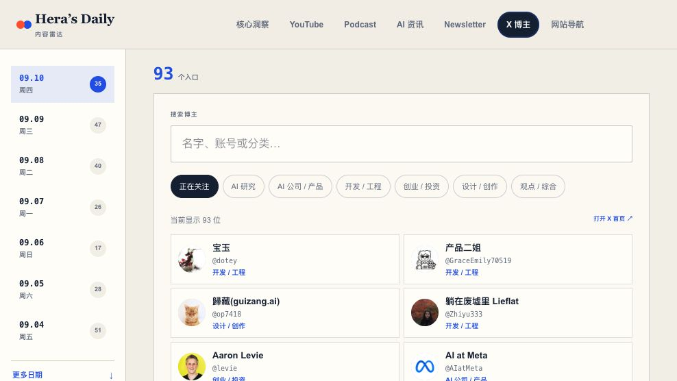

# Hera 内容雷达 Skill

简体中文 · [English](README.en.md)

把分散在 YouTube、Podcast、AI 资讯、Newsletter 和 X 的内容，整理成每天可阅读、可追溯的中文内容雷达。


## 这是什么

Hera Content Radar 是一个面向 Codex、Claude Code 等智能体的 Agent Skill。它不是一个固定的信息聚合网站，而是一套可以安装、修改来源、持续刷新并接入现有发布方式的工作流。

它可以帮助智能体：

- 同时检查今天和昨天，补录延迟发布或遗漏的内容。
- 优先使用 YouTube 字幕、Podcast 节目说明和公开逐字稿。
- 生成有证据边界的中文摘要，保留原始标题与链接。
- 从全部模块提炼“今日看点”和“今日选题”。
- 管理、规范化并去重信息源，不因一次抓取失败清空旧数据。
- 为 X 博主目录缓存公开头像，减少页面对 X 图片服务器的依赖。

## 快速开始

### 1. 用智能体安装（推荐）

把下面这段话直接发给 Codex、Claude Code 或其他支持 Agent Skills 的智能体：

```text
请从 https://github.com/hihera/hera-content-radar-skill
安装 Hera Content Radar Skill。把它放到当前智能体的个人 Skills 目录，
确保 SKILL.md 位于 hera-content-radar 文件夹根目录。安装完成后告诉我
是否需要开启新会话，暂时不要创建网站。
```

智能体会使用自己的 Skill 安装器，或者把仓库克隆到正确目录。安装后通常需要新开一个会话，让智能体重新扫描 Skills。

### 2. 创建第一个内容雷达

```text
使用 $hera-content-radar 和公开默认来源，为我创建一个每日内容雷达，
先在本地打开预览。
```

已有内容雷达时，可以直接说：

```text
使用 $hera-content-radar 刷新今天和昨天，保留更早的数据，
完成检查后打开最新页面。
```

## 批量更改信息源（推荐）

不需要逐个修改 JSON，也不需要自己查找 YouTube Channel ID 或 Podcast RSS。最简单的方法是一次性把链接交给智能体。

### 方式一：直接粘贴一批链接

```text
使用 $hera-content-radar，把下面这些链接批量加入我的信息源。
请自动判断它们属于 YouTube、Podcast、资讯、Newsletter、X 博主或网站导航，
解析稳定 ID 或 RSS，去重并报告无法确认的链接：

https://x.com/OpenAI
https://www.youtube.com/@AndrejKarpathy
https://example.com/podcast
https://example.com/newsletter
```

链接可以一行一个，也可以带上名称和简单备注。智能体会先整理成规范化目录，再更新内容。

### 方式二：上传一个简单清单

复制 [source-inbox.example.txt](assets/source-inbox.example.txt)，把自己的链接放进去，然后把文件交给智能体：

```text
使用 $hera-content-radar 导入我附上的来源清单。
自动识别类型、补全稳定 ID 或 RSS、去重，并把无法确认的项目单独列出来。
```

这个清单不要求严格格式，以下写法都可以：

```text
https://x.com/OpenAI
YouTube | Andrej Karpathy | https://www.youtube.com/@AndrejKarpathy
Newsletter | Example | https://example.com/newsletter
```

### 方式三：直接维护配置文件

适合熟悉项目结构的用户：

- 当前雷达的信息源：`data/sources.json`
- 新雷达的默认来源：`assets/default-sources.json`
- X 博主清单：`assets/default-x-creators.json`

修改后让智能体执行验证和去重即可。`scripts/catalog.py` 是可选的命令行辅助工具，不是新手使用 Skill 的前置要求。

## 用户手动安装

macOS、Windows 和 Linux 使用同一套文件和安装流程，区别只是用户目录的显示方式。

1. 打开智能体的个人 Skills 目录：

| 智能体 | 个人 Skills 目录 |
| --- | --- |
| Codex | 用户主目录中的 `.codex/skills` |
| Claude Code | 用户主目录中的 `.claude/skills` |

2. 在该目录打开终端并运行：

```bash
git clone https://github.com/hihera/hera-content-radar-skill.git hera-content-radar
```

3. 新开一个智能体会话。

如果没有 Git，也可以下载仓库 ZIP，解压为 `hera-content-radar`。请确认 `SKILL.md` 直接位于该文件夹根目录。

更新已安装版本时，在 Skill 文件夹中运行：

```bash
git pull --ff-only
```

## 默认信息源

仓库内置一组可自由删改的公开起步来源，例如：

- YouTube：How I AI、The Pragmatic Engineer、IBM Technology、Andrej Karpathy、Lenny's Podcast 等。
- Podcast：硅谷101、疯投圈、声动早咖啡、文化有限等公开 RSS。
- AI 与科技资讯：TechCrunch AI、The Verge AI、Google Blog、Hugging Face Blog。
- Newsletter：Lenny's Newsletter、The Rundown AI、TLDR、Every、Stratechery。
- 网站导航：AIHOT、GitHub Trending、模型和 AI 工具目录。
- X：AI 研究、产品、开发、投资和创作领域的公开账号。

这些来源只是可编辑的起点，不代表背书或强制依赖。

## 页面预览

<p align="center">
  
  
</p>

## 内容原则

- YouTube 优先使用人工字幕，其次使用自动字幕；默认不下载音频转写。
- 只拿到标题或简介时，会明确限制，不包装成深度摘要。
- “今日看点”必须是有支撑来源的结论，不是文章列表换一种写法。
- X 私密 List、登录后时间线和付费内容可能无法公开读取；公开账号链接仍可作为导航。

## 仓库结构

```text
hera-content-radar-skill/
├── SKILL.md
├── agents/openai.yaml
├── assets/
│   ├── default-sources.json
│   ├── default-x-creators.json
│   └── source-inbox.example.txt
├── references/
├── scripts/catalog.py
└── docs/images/
```

## 开源协议与内容边界

本项目使用 [MIT License](LICENSE)。MIT 协议适用于本仓库的 Skill 指令、脚本和自有资源；第三方文章、Feed、视频、Podcast、头像、名称和商标仍归各自权利方所有。请勿把 Cookie、Token、付费 Feed 密钥或其他凭证提交到公开仓库。
