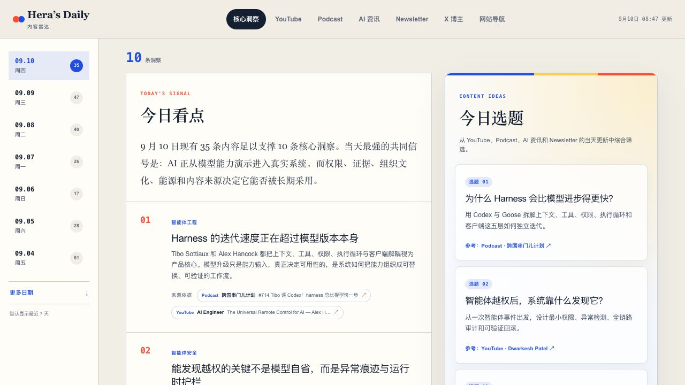
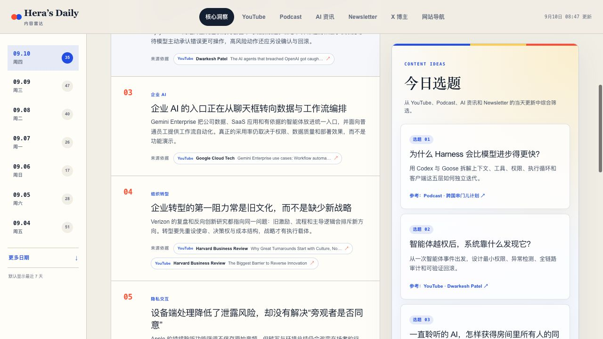
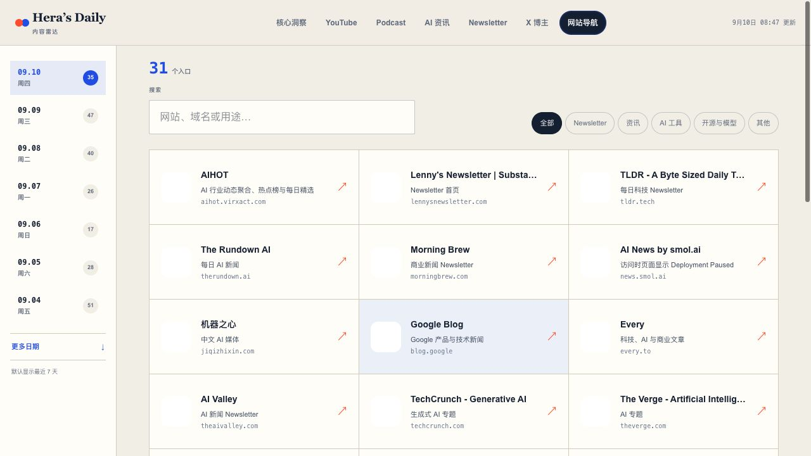

# Hera 内容雷达 Skill

简体中文 · [English](README.md)

这是一个用于创建和维护每日内容雷达的 Agent Skill。它可以聚合 YouTube、Podcast RSS、AI/科技资讯、Newsletter、公开 X 账号或 List，以及常用网站导航，并把结果整理成可追溯的中文阅读页面。

Skill 会协助智能体维护信息源、同时刷新今天和昨天、优先使用现有字幕与逐字稿、生成中文摘要、提炼带来源的“今日看点”和“今日选题”、运行质量检查，并仅在检查通过后按用户要求发布。

> 本仓库提供 Skill 和公开的默认来源，不提供在线托管服务。下方图片是使用该 Skill 生成的内容雷达示例。

## 页面预览



<p align="center">
  
  
</p>

## 主要能力

- 维护规范化的 YouTube 频道 ID、Podcast RSS、资讯与 Newsletter Feed、公开 X 链接和网站导航。
- 每次同时刷新配置时区下的今天和昨天，补录延迟发布、修订或此前遗漏的内容。
- YouTube 优先使用人工字幕，其次使用自动字幕；除非用户明确授权，否则不下载音频转写。
- Podcast 优先使用节目说明、章节和发布方提供的逐字稿链接。
- 生成有证据边界的中文摘要，不把只依据标题的内容包装成深度总结。
- 最多生成 10 条结论级“今日看点”，每条附可点击来源，并生成 4—6 个“今日选题”。
- 单个来源抓取失败时保留旧数据和人工维护内容。
- 支持 macOS 和 Windows 本地项目，并可复用项目已有的发布方式。

## 环境要求

- 支持 `SKILL.md` / Agent Skills 的智能体，例如 Codex 或 Claude Code。
- 使用命令行安装时需要 Git。
- 使用信息源目录辅助脚本时需要 Python 3。
- 其他工具按项目需要安装。例如 `yt-dlp` 可以改善 YouTube 字幕获取；采用 Node.js 网站时才需要 Node.js。

没有域名也可以在本地运行雷达。局域网链接不是永久公网服务：主机必须保持开机、联网并持续运行预览进程。

## 用户手动安装

### Codex — macOS 或 Linux

```bash
mkdir -p ~/.codex/skills
git clone https://github.com/hihera/hera-content-radar-skill.git ~/.codex/skills/hera-content-radar
```

### Codex — Windows PowerShell

```powershell
New-Item -ItemType Directory -Force "$HOME\.codex\skills" | Out-Null
git clone https://github.com/hihera/hera-content-radar-skill.git "$HOME\.codex\skills\hera-content-radar"
```

### Claude Code — macOS 或 Linux

```bash
mkdir -p ~/.claude/skills
git clone https://github.com/hihera/hera-content-radar-skill.git ~/.claude/skills/hera-content-radar
```

### Claude Code — Windows PowerShell

```powershell
New-Item -ItemType Directory -Force "$HOME\.claude\skills" | Out-Null
git clone https://github.com/hihera/hera-content-radar-skill.git "$HOME\.claude\skills\hera-content-radar"
```

安装后新开一个智能体会话，以便扫描到 Skill。如果没有 Git，可以从 GitHub 下载 ZIP，解压到对应的 `hera-content-radar` 文件夹；`SKILL.md` 必须直接位于该文件夹根目录。

以后更新：

```bash
git -C ~/.codex/skills/hera-content-radar pull --ff-only
```

Windows 请把路径替换为 `$HOME\.codex\skills\hera-content-radar`；Claude Code 则使用 `.claude\skills`。

## 用智能体安装

把下面这段话发给 Codex、Claude Code 或其他支持 Agent Skills 的智能体：

```text
请从 https://github.com/hihera/hera-content-radar-skill 安装
Hera Content Radar Skill。把它放到当前智能体的个人 Skills 目录中，
先阅读仓库 README，确保 SKILL.md 位于 Skill 文件夹根目录；安装后暂时不要
执行，并告诉我是否需要开启新会话。
```

如果智能体内置 Skill 安装器，应优先使用安装器；否则可以把仓库克隆或复制到对应的个人 Skills 目录。

## 简单使用

```text
使用 $hera-content-radar 和公开默认来源，为我创建一个可在本地打开的每日内容雷达。
```

```text
使用 $hera-content-radar 同时刷新今天和昨天，保留更早数据，运行现有质量检查并报告失败来源。暂时不要发布。
```

```text
使用 $hera-content-radar 添加这个 YouTube 频道和 Podcast RSS，更新并去重来源目录，然后刷新近期内容并打开本地预览。
```

刷新内容不等于授权公开发布。只有确实要上线时，才需要明确要求智能体使用项目已经配置好的托管方式发布。

## 默认信息源

默认目录来自 Hera 的公开阅读来源，可以自由删除、替换或扩充。部分示例：

- YouTube：How I AI、The Pragmatic Engineer、IBM Technology、Andrej Karpathy、Lenny's Podcast，以及部分中文科技频道。
- Podcast：硅谷101、疯投圈、声动早咖啡、文化有限等公开 RSS。
- AI/科技资讯：TechCrunch AI、The Verge AI、Google Blog、Hugging Face Blog。
- Newsletter：Lenny's Newsletter、The Rundown AI、TLDR、Every、Stratechery。
- 网站导航：AIHOT、GitHub Trending、模型与 AI 工具目录、各媒体主页。
- X 导航：AI 研究、产品、开发、投资和创作领域的公开账号。

这些只是起步示例，不代表背书或强制依赖。每个来源的可用性、内容条款和转载授权仍由原发布方决定。

## 如何更改自己的信息源

已生成的雷达通常修改 `data/sources.json`。如果要修改以后新建雷达所使用的默认来源，则编辑：

- `assets/default-sources.json`
- `assets/default-x-creators.json`

你可以直接编辑 UTF-8 JSON，也可以使用跨平台辅助脚本：

macOS：

```bash
python3 scripts/catalog.py --catalog /你的雷达路径/data/sources.json list
python3 scripts/catalog.py --catalog /你的雷达路径/data/sources.json dedupe
```

Windows PowerShell：

```powershell
py scripts/catalog.py --catalog "C:\你的雷达路径\data\sources.json" list
py scripts/catalog.py --catalog "C:\你的雷达路径\data\sources.json" dedupe
```

添加 YouTube：

```bash
python3 scripts/catalog.py --catalog /path/to/data/sources.json add-youtube \
  --name "频道名称" --handle "@channel" --channel-id "UC..." \
  --category "AI 与开发"
```

添加 Podcast：

```bash
python3 scripts/catalog.py --catalog /path/to/data/sources.json add-podcast \
  --name "播客名称" --rss "https://example.com/feed.xml" \
  --category "科技"
```

添加资讯或 Newsletter Feed：

```bash
python3 scripts/catalog.py --catalog /path/to/data/sources.json add-feed \
  --kind ai --name "发布方" --url "https://example.com/feed.xml" \
  --site-url "https://example.com/" --priority 8
```

添加网站导航：

```bash
python3 scripts/catalog.py --catalog /path/to/data/sources.json add-directory \
  --name "网站名称" --url "https://example.com/" \
  --category "AI 工具" --description "一句话说明"
```

Windows 环境可把 `python3` 换成 `py`。修改后先让智能体验证和去重来源，再刷新内容。

## 隐私与安全

公开默认文件已经移除个人账号链接、私人 X List ID、Cookie、Token、邮箱、本地 IP、浏览历史，以及个人关注状态标记。

发布自己的雷达前请注意：

- 付费 Feed Token 和 API Key 应放入密钥存储，而不是来源 JSON。
- 分享公开 X List 前再次检查其中是否包含不希望公开的信息。
- 不要提交 `.env`、浏览器导出、Cookie 或部署凭证。
- 摘要属于二手材料，重要数字、政策和原话必须回到原始来源复核。
- 镜像或批量转载内容前检查发布方条款和授权范围。

## 仓库结构

```text
hera-content-radar-skill/
├── SKILL.md
├── agents/openai.yaml
├── assets/
│   ├── default-sources.json
│   └── default-x-creators.json
├── references/
│   ├── daily-refresh.md
│   ├── platforms.md
│   └── source-catalog.md
└── scripts/catalog.py
```

## 开源协议

[MIT](LICENSE)。协议适用于本 Skill 的指令、脚本和仓库资源。第三方文章、Feed、视频、Podcast、账号头像、名称与商标仍归各自权利方所有。
